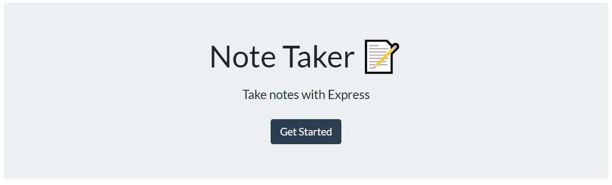

# Notetaker Application 

Live App - https://desolate-beyond-54031.herokuapp.com/

## License 
                                 

## Description
This application was created for people who like to type down their To Do's on a daily or weekly basis. Its extremely simple and quick to use!

## Table of Contents
* [Installation](#Installation-Guide)
* [Usage](#Usage)
* [Contributors](#Contributors)
* [Contact-Information](#contact-Information)

## Installation Guide
Clone this repository and host the application using your own server.
        
## Usage
Extremely simple just 'click' on create note then write your desired title, and finally continue on to your note taking.
        
## Contributors
Jesus Rios

## Contact Information
Github Username - [JesusFernandoRios](http://github.com/JesusFernandoRios)

E-mail - JesusFernandorios@outlook.com
